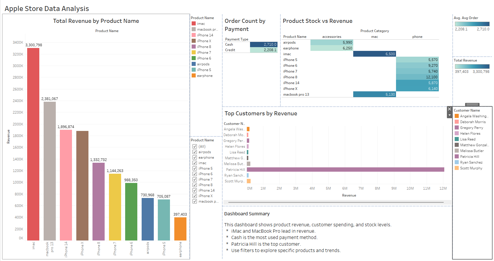

# Apple_Store_Data_Analysis

## Project Overview

**Project Title**: Retail Sales Analysis  
**Level**: Beginner  

This project demonstrates the end-to-end process of data analysis using SQL for data transformation and Tableau for interactive visualization. Based on a dataset from Kaggle, the goal was to explore key business metrics such as product revenue, customer behavior, stock levels, and payment trends

## 🔧 Tools Used
- PostgreSQL (SQL for data cleaning and analysis)
- Tableau Public (data visualization & dashboard)
- GitHub (project sharing)

  ## 📂 Dataset Source

This project uses publicly available data from Kaggle:

- [Apple Store Data Analysis Dataset on Kaggle](https://www.kaggle.com/datasets/najir0123/sql-beginner-projects-apple-store-data-analysis)


## Data Analysis & Findings

The following SQL queries were developed to answer specific business questions:

1. **What’s the total revenue by product category?**
```sql
SELECT p.product_name,
	SUM(o.quantity_ordered) as quantity_sold, -- to add toolstips in tableau
	AVG(p.price), -- for toolstips tableau
	SUM(p.price * o.quantity_ordered) as revenue
FROM products p
LEFT JOIN orders o ON p.product_id = o.product_id
GROUP BY 1
ORDER BY revenue DESC;
```

2. **Which customers generate the most revenue?**
```sql
SELECT c.customer_name, 
	SUM(p.price * o.quantity_ordered) as revenue
FROM products p
LEFT JOIN orders o On p.product_id = o.product_id
LEFT JOIN customers c ON o.customer_id = c.customer_id
GROUP BY 1
ORDER BY revenue DESC;
```

3. **Which products are low stock but high selling?**
```sql
SELECT p.product_name, p.stock,
	SUM(o.quantity_ordered) as total_items_sold,
	SUM(o.quantity_ordered * p.price) as total_order_amount
FROM products p
INNER JOIN orders o ON p.product_id = o.product_id
GROUP BY 1,2
HAVING p.stock < 15 AND SUM(o.quantity_ordered * p.price) > 10000 
ORDER BY total_order_amount DESC
```

4. **What is the average order value by payment type?**
```sql
SELECT o.payment_type,
	COUNT(*) payment_type,
	ROUND(AVG(p.price * o.quantity_ordered):: numeric,2) as avg_order
FROM orders o
INNER JOIN products p ON o.product_id = p.product_id
GROUP BY 1
```

5. **Which product categories have the highest average price?**
```sql
SELECT product_category,
	COUNT(*) product_category,
	MAX(price), MIN(price),
	ROUND(AVG(price):: numeric,2) as avg_price
FROM products
GROUP BY 1
ORDER BY 2 DESC;
```

## 📊 Tableau Dashboard
View the full dashboard here 👉 https://public.tableau.com/shared/XH74872PN?:display_count=n&:origin=viz_share_link



## 📌 Summary
- iMac and MacBook Pro lead in total revenue.
- Patricia Hill is the top customer.
- Cash is used more often than credit for purchases.
- Heatmap shows important stock/revenue relationships.


